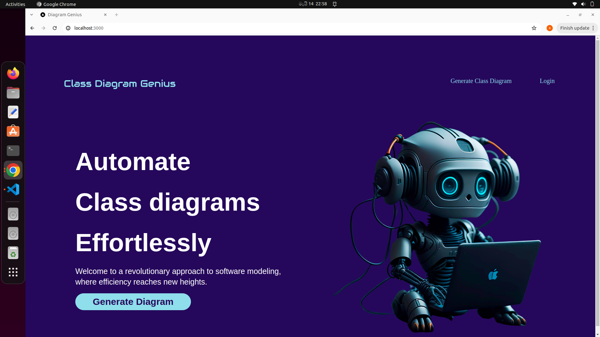

# Class-Diagram-Genius

Introducing Class-Diagram-Genius: a user-friendly tool that seamlessly translates text-based scenarios into visually informative class diagrams. Users input their scenario text, and our application generates a corresponding diagram, which can be exported as a PNG file for easy integration. Additionally, advanced users can generate Java code directly from the diagram, complete with folder structures and file contents, streamlining the development process. From conceptualization to implementation, Class-Diagram-Genius offers an intuitive interface for software design and development, catering to both beginners and experienced developers alike. Experience the synergy of text-based ideation and visual representation with Class-Diagram-Genius today.

